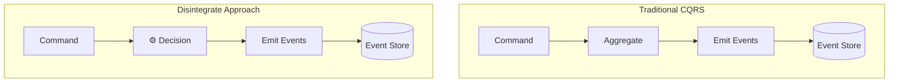

# FAQ

**Q: What is Disintegrate and how does it relate to CQRS and Event Sourcing?**

A: Disintegrate is a framework that simplifies the implementation of CQRS and Event Sourcing patterns.
Disintegrate focuses on handling commands `Decision` directly, instead of working through aggregates. 
This makes it easier to identify and add new commands without changing existing aggregate structures.



**Q: Why use Disintegrate instead of traditional approaches?**

A: Traditional CQRS approaches often involve tightly coupled components, making modifications difficult. 
The challenge of identifying the right aggregates and changing them adds complexity. 
**Disintegrate** simplifies integration and enhances flexibility for evolving system requirements. 
Additionally, it offers a way to query the event store, enabling dynamic splitting or joining of multiple streams to create customized states for decision-making;
It simplifies the process compared to modifying aggregates in traditional systems.

**Q: What problem does Disintegrate solve?**

Disintegrate addresses the difficulty of identifying the right aggregates at the start of a project and the common need to access information from multiple aggregates as new features emerge. 
It enables dynamic querying of event stores to split or join multiple streams, allowing flexible state creation for decision-making without imposing strict stream boundaries


**Q: How does Disintegrate relate to event sourcing?**

Disintegrate operates on event streams, allowing applications to read and combine multiple streams dynamically. 
This approach supports evolving requirements by enabling stream splitting or joining either at the storage level or dynamically at the application level, enhancing the flexibility of event-sourced systems.


**Q: What is the "Cheating" chapter mentioned in the context of Disintegrate?**

The "Cheating" chapter in Gregory Young's book discusses techniques to overcome the limitations of fixed stream boundaries by either duplicating events to create new streams (splitting) or combining streams (joining). 
Disintegrate implements this concept by allowing dynamic querying and combination of event streams to build domain states.

**Q: How do I start a new project with Disintegrate?**
 
- Begin with an Event Storming session. This helps you understand the business, find important events, commands, and groups of related data (called aggregates).
- Next, organize and improve your model by identifying aggregates, sub-domains, and bounded contexts (different parts of the system).
- With Disintegrate, focus on the decisions your system needs to make, because decisions trigger important changes (events) in the system.

**Q: How does Disintegrate handle concurrency conflicts, especially with high usage of new features like coupons?**

A: Disintegrate may experience concurrency conflicts when multiple users try to access and modify the same resources (e.g., coupons) simultaneously. 

Approaches to address this include:
- Introducing a lock mechanism for exclusive access, allowing only one client to access. 
- Employing a queue to execute commands sequentially. Multiple queues could be designed to process each command with same ID or group.  
- Allowing overbooking (if permissible by the business model) by excluding specific events during conflict checking, using `ValidationQuery`.

**Q: How do I add a new feature using Disintegrate?**

A: To add a new feature, define a new state (if needed) and a new Decision that represents the command. 
Use state queries to retrieve relevant state and implement the business logic in the `process` method of the `Decision` . 
For example, when adding a coupon feature, define a `Coupon` state `ApplyCoupon` decision

**Q: Can you provide an example of defining a new state in Disintegrate?**

A: Yes, here's an example of defining a state: `Coupon`
```rust
#[derive(Debug, Clone, StateQuery, Default, Deserialize, Serialize)]
#[state_query(CouponEvent)]
struct Coupon {
   #[id]
   coupon_id: String,
   quantity: i32
}
```

**Q: How do I handle coupon availability when applying a coupon using Disintegrate?**

A: In the `ApplyCoupon` decision, use state queries to retrieve the `Coupon` state and check if the coupon is available (quantity > 0) before applying it. 

**Q: How do I allow overbooking of coupons in Disintegrate?**

A: To allow overbooking, use the method `validation_query` in the `ApplyCoupon` decision to exclude `CouponApplied` events from the conflict validation. 
This can be achieved using the `exclude_events`  method. 

Here's the example:

```rust
impl Decision for ApplyCoupon {
    type Event = DomainEvent;
    type StateQuery = (Cart, Coupon);
    type Error = CartError;

    fn validation_query<ID: disintegrate::EventId>(&self) -> Option<StreamQuery<ID, Self::Event>> {
        let (cart, coupon) = self.state_query();
        // the validation query is the union of the two state queries used by the decision
        Some(union!(
            //the original cart state query will be used to validate the decision against user's cart changes.
            &cart,
            // exclude the `AppliedCoupon` event from the coupon state query to allow some overbooking.
            coupon.exclude_events(event_types!(DomainEvent, [CouponApplied]))
        ))
    }
}

```


